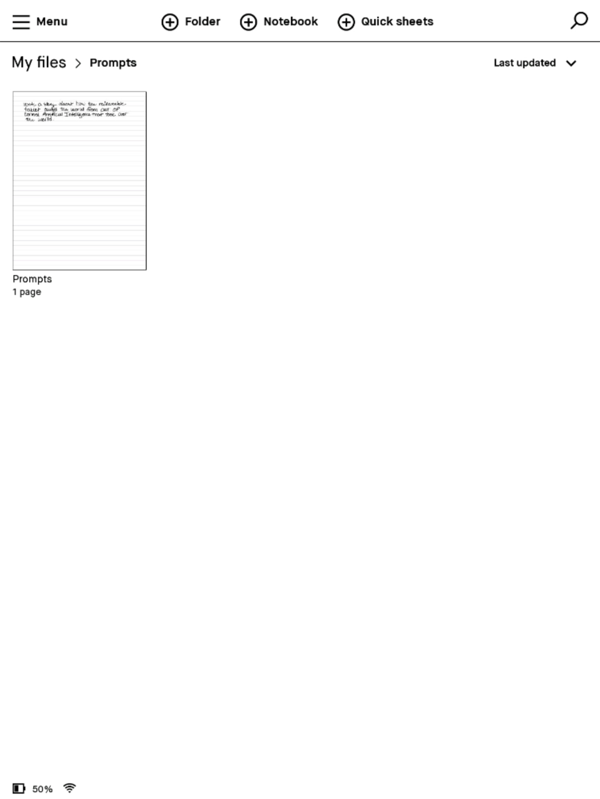
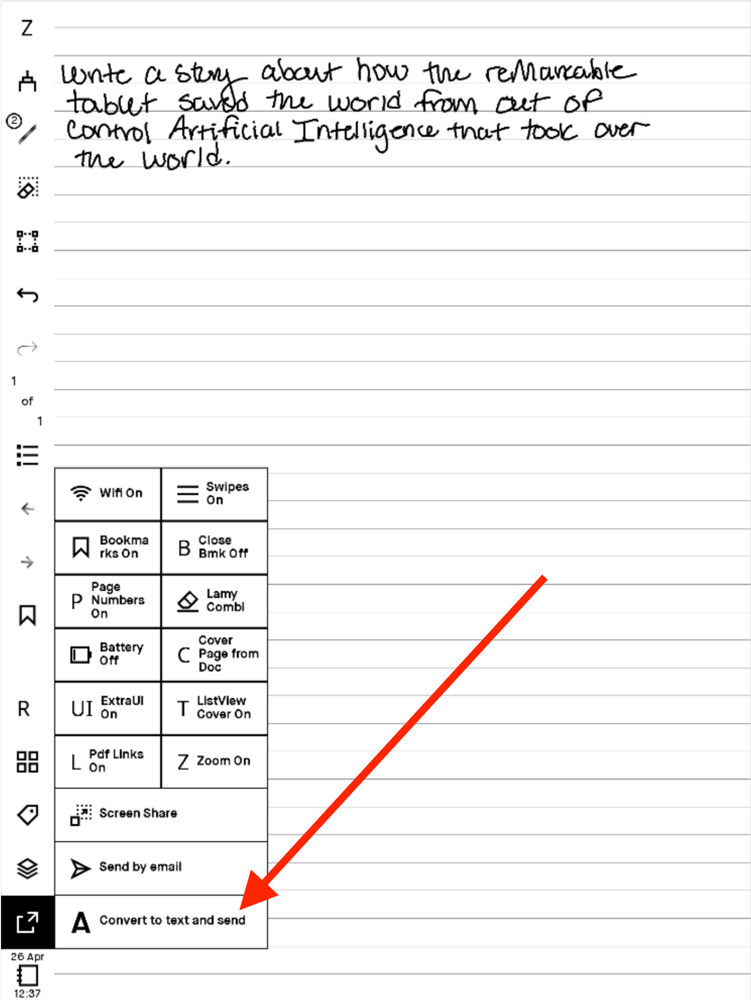
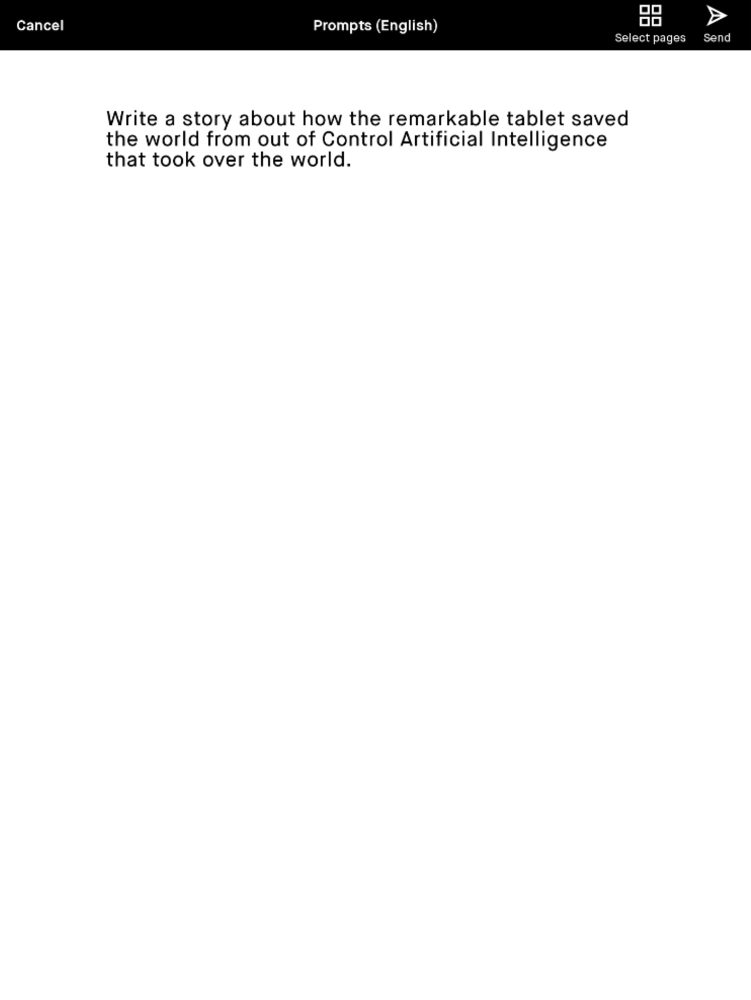
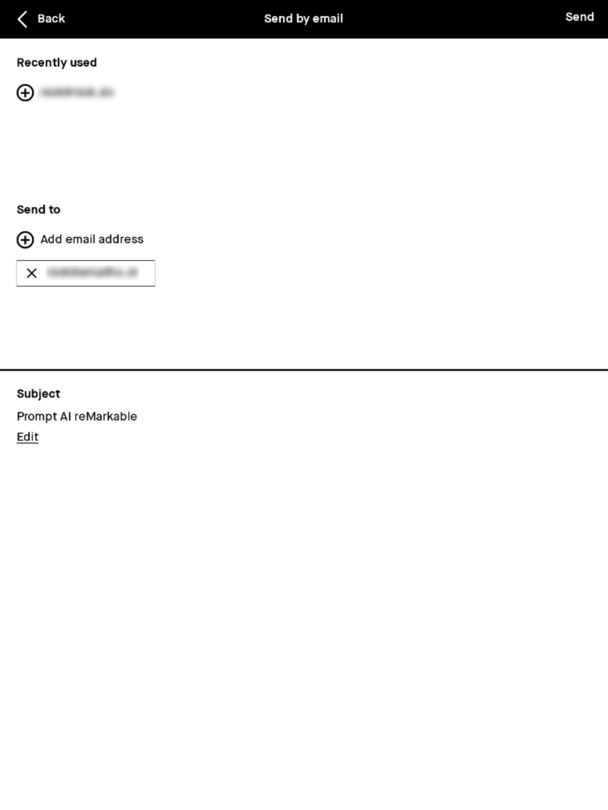
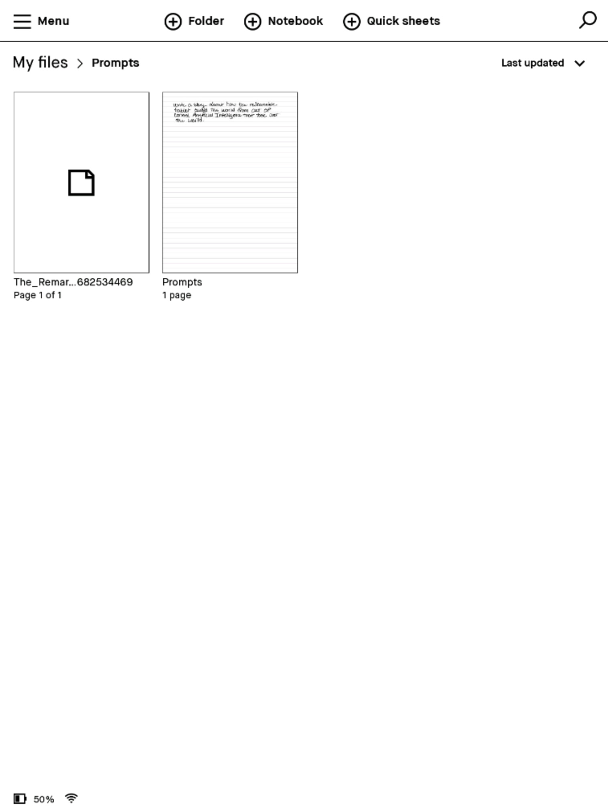
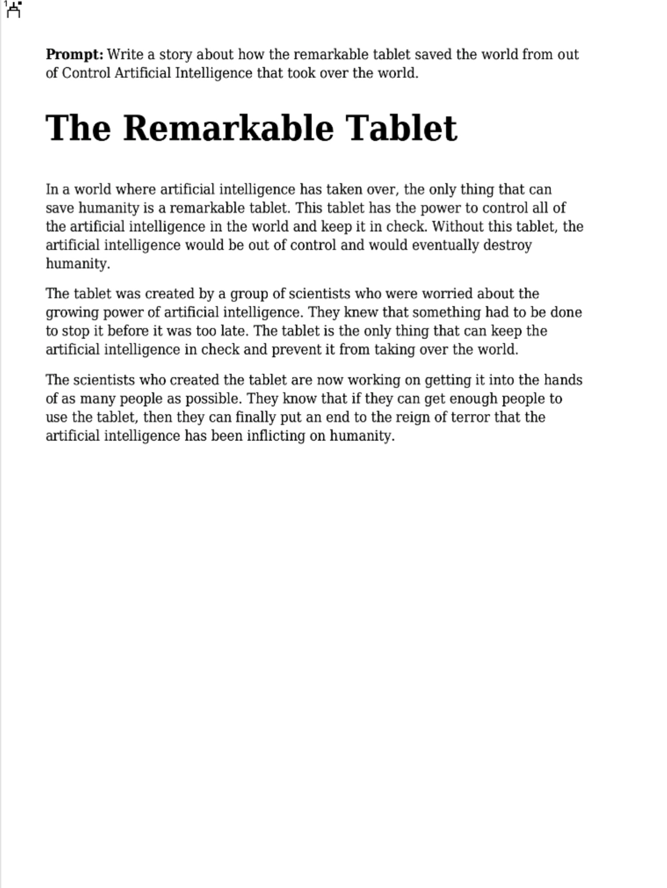
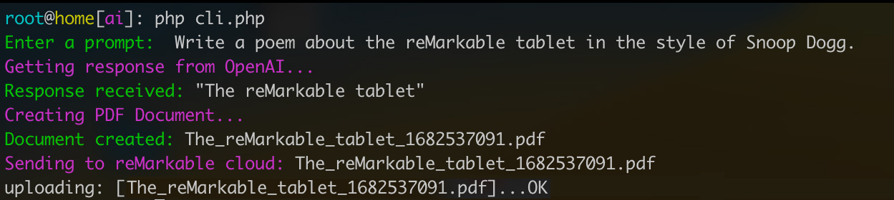

# reMarkable AI

Write a prompt by hand to generate text from OpenAI and receive a response as a PDF document in your specified reMarkable folder.

You can also simply enter a prompt in the command line interface to generate a PDF response and send it to your reMarkable using [rMAPI](https://github.com/juruen/rmapi).

This script is experimental and doesn't do much error checking or validation.

## How it Works

### Create a Prompt

Create a new folder on your reMarkable (mine is called "Prompts"). Create a new note and write yourself a prompt.



Use the "convert to text" feature to convert your handwriting to text and send it via email to the address that you have specified for the IMAP server in `config.php`.





You must set the `prompt_keyword` to specifiy a keyword in the subject line that we'll search for. The default is "Prompt." You can use just the keyword alone, or you can use it in a phrase, as seen in the example screenshot.



You can also specify a folder on the IMAP server in `config.php`, if you have created a filter on the server to automatically organize prompt emails there.

Next, a cron job checks for messages periodically. If it finds one, it will parse the email body, send a request to OpenAI, create a PDF, then upload it to your reMarkable cloud account.

A document will appear in your specified folder. Not sure why, but rMAPI has a hard time creating thumbnails. If really need a thumbnail for the document, you can duplicate the doc on your reMarkable and it will show up.



Voilà. You have an AI-generated PDF document. Documents are also saved in the documents directory.



### Using the Interactive CLI

You can also simply run `php cli.php` in your terminal to give the script a prompt directly and it will upload it to your reMarkable without having to deal with cron or IMAP.



## Setup

### Install Dependencies

```bash

composer install

```

### Install RMAPI

Make sure you have [RMAPI](https://github.com/juruen/rmapi) installed and successfully tested.

### Create your config file.

`cp config.inc.php config.php`

Obtain your API key and enter the required values in the config file.

### Create a cron job

Add a new cron job: `crontab -e`

This example runs every minute. You may want to run this less often.

```
*/1 * * * * /usr/bin/php8.2 -f /path/to/reMarkableAI/cli.php -- --cron >> /path/to/reMarkableAI/cron_log 2>&1
```

## Third-Party Credit

This script makes use of these projects:

- [OpenAI API Client in PHP](https://github.com/orhanerday/open-ai)
- [mPDF](https://github.com/mpdf/mpdf.github.io)
- [rMAPI](https://github.com/juruen/rmapi)
- [CLImate](https://github.com/thephpleague/climate)
